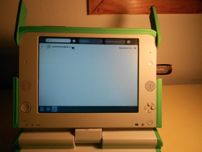

Creando una actividad para Sugar XO
===================================

Glucosa incluye una plantilla de actividad para Sugar XO
muy fácil de utilizar.

En esta sección veremos cómo crear una actividad básica
a partir de la plantilla y cómo llevarla a la XO utilizando
un pendrive.

Introducción
------------

Las actividades de SugarXO tienen una estructura que le
permiten a la XO realizar el proceso de despliegue, actualización y
configuración correctamente.

El primer paso para crear una actividad es clonar el repositorio
de glucosa::

    git clone git://github.com/hugoruscitti/glucosa.git

Se creará un nuevo directorio llamado glucosa, y dentro de él un
directorio con la plantilla de la actividad.

El siguiente paso es configurar la plantilla para que utilice
glucosa y genere un repositorio propio::

    cd glucosa
    cd activity-template
    cp ../glucosa.py ./ 

    git init
    git add .
    git commit -m "creando actividad."

Los últimos tres comandos aseguran que el proceso de empaquetado
de la aplicación recolecte todos los archivos necesarios. Si agregas
nuevos archivos es importante hacer ``git add .`` y un ``git commit -m "algo"``
antes que empaquetar.

.. note:: 

    En el directorio de la plantilla hay un archivo llamado ``aceituna.png``, este archivo
    solo se utiliza en nuestro ejemplo, si quieres hacer una nueva actividad que no
    lo utiliza podrías borrarlo tranquilamente.

Generando la actividad
----------------------

Una vez dentro del directorio de la plantilla puedes generar un paquete
instalable de la actividad.

Tienes que ejecutar el siguiente comando::

    python setup.py dist_xo

Y la nueva actividad se tendría que haber generado dentro del directorio
``dist``::

    $ ls dist/
    ActivityTemplate-1.xo

Perfecto, ahora la aplicación se puede copiar en un pendrive y llevar
a la XO::

    cp dist/ActivityTemplate-1.xo /media/pendrive_path

Instalación
-----------

Solamente tienes que conectar el pendrive con la actividad directamente
en el equipo XO:

Cuando el pendrive ya esté conectado, tendría que aparecer en la parte
inferior de la pantalla un ícono para acceder al contenido del pendrive:

Cuando lo selecciones, aparecerá el ícono de nuestra actividad, tienes que
pulsarlo y eso iniciará la Instalación y ejecución de la actividad:

Funcionó !

Cambiando el ícono de la actividad
----------------------------------

Cuando la actividad esté instalada, habrá un ícono
que va a servir para identificarla en todo el sistema:

Este ícono se puede modificar, por ejemplo usando la aplicación `Inkscape <http://inkscape.org>`_:

El archivo que represenata al icono es ``activity/activity-helloworld.svg``.

Actualizando la actividad
-------------------------

Para actualizar una versión tienes que cambiar el código de tu actividad
y llamar nuevamente al comando ``python setup.py dist_xo``.

Es importante que actualices el archivo ``activity/activity.info``, porque cada
nueva versión tiene que aumentar el valor de la variable ``activity_version``. De 
otra forma la XO no reconocerá que se trata de una nueva versión.

Otro punto a tener en cuenta, es que el proceso de empaquetado solamente tendrá
en cuenta los archivos gestionados por el repositorio git que creamos al 
principio. Así que es una buena idea aprender algo de Git!, o simplemente
hacer ``git add .`` y ``git commit -m "?"`` antes de realizar las nuevas
vesiones.

¿Dónde se instalan las actividades?
-----------------------------------

Las actividades se instalan en el directorio ``Activities`` (que está a su vez
dentro del directorio personal del usuario).

Así que podrías acceder a ese directorio para hacer cambios de prueba o simplemente
para borrar la actividad.

Distribuyendo la actividad
--------------------------

El equipo de desarrollo de sugar tiene un sitio espectacular para
publicar y distribuir actividades. La dirección para acceder es:

http://activities.sugarlabs.org

