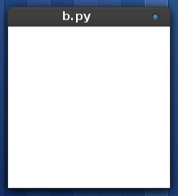
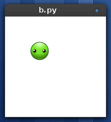
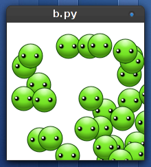

.. _tutorial:

Tutorial de programación básico
===============================

En este documento veremos cómo construir un programa
con glucosa paso a paso. Utilizaremos funciones de la biblioteca
básica, así que las instrucciones son válidas tanto para programar
desde GNU/Linux cómo dentro de Sugar XO.

Comenzando
----------

Glucosa funciona gracias a un sistema de eventos provisto por gtk, así
que tu código tiene escribirse siguiendo una mínima estructura que le
permita funcionar junto a gtk sin problemas.

Internamente, el area de dibujo de ``glucosa`` es un widget de ``gtk``, así
que si conoces ``gtk`` esto va a ser sencillo.

Comencemos la estructura de un programa estilo ``glucosa``:

.. code-block:: python

    # -*- coding: utf-8 -*-
    import pygtk
    import gtk
    import glucosa

    class Game:

        def __init__(self):
            (self.window, self.canvas) = glucosa.create_window()
            self.mainloop = glucosa.MainLoop(self, self.canvas, fps=60)

        def on_update(self):
            pass

        def on_draw(self, context):
            pass

    if __name__ == '__main__':
        juego = Game()
        gtk.main()

La primer parte del código realmente importante es ``juego = Game()`` y ``gtk.main()``. Estas
dos lineas inician el juego y lo mantienen en funcionamiento (respectivamente).

La clase ``Game`` se utiliza para representar al programa completo, el método ``__init__``
construye una ventana, un widget para dibujar (canvas) e inicializa un objeto ``MainLoop``.

Veamos un poco mas de cerca a ``MainLoop``:

MainLoop
--------

Los videojuegos son un poco especiales, si bien son programas cómo cualquier otro, funcionan
de forma ligeramente diferente.

En los programas convencionales, el funcionamiento está gobernado por el usuario. El programa
queda esperando a que el usuario haga algo, y cuando el usuario lo hace el programa
responde.

En un videojuego es diferente, el videojuego tiene que hacer algo todo el tiempo, los personajes
tienen que caminar, las naves seguir volando etc.

Aquí es donde entra en juego ``MainLoop``. Este objeto se encarga de mantener al juego
activo, haciendo cosas todo el tiempo, independientemente de que el usuario inicie alguna
acción. El objeto ``MainLoop`` espera ser iniciado con al menos dos parámetros::

        glucosa.MainLoop(controller, canvas, fps)

- ``controller``: es el objeto que se encargará de actualizar y redibujar la ventana, suele ser el mismo objeto que inicia el MainLoop. Es importante que el objeto que coloquemos ahí tenga los métodos ``on_update`` y ``on_draw``.
- ``canvas``: es un objeto ``gtk.DrawingArea``, se puede crear con la función ``glucosa.create_window`` o directamente
  usando ``gtk`` por nuestra cuenta.
- ``fps``: es un número entero, que indicará la velocidad de ejecución del juego. Es el acrónimo en inglés de "Frames Per Second", e indica cuantas veces se llamará a la función "on_update" por segundo. Poner esto a 60 es lo ideal, aunque algunos juegos usan 30 o incluso 24...

Colocando al primer personaje
-----------------------------

Los personajes de glucosa se llaman ``sprites``, y consisten en objetos que representan
un punto en la pantalla y tienen asociada una imagen.

Por ejemplo, para crear un ``Sprite`` podríamos escribir:

.. code-block:: python

    imagen = glucosa.Image('data/aceituna.png')
    mi_sprite = glucosa.Sprite(imagen)

Una vez creado el personaje, es importante tener una referencia a él y también dibujarlo en
cada actualización. Ampliemos un poco el código inicial:

.. code-block:: python

    # -*- coding: utf-8 -*-
    import pygtk
    import gtk
    import glucosa

    class Game:

        def __init__(self):
            (self.window, self.canvas) = glucosa.create_window()
            self.mainloop = glucosa.MainLoop(self, self.canvas, fps=60)
    
            imagen = glucosa.Image('data/aceituna.png')
            self.mi_sprite = glucosa.Sprite(imagen, 50, 50)

        def on_update(self):
            pass

        def on_draw(self, context):
            self.mi_sprite.draw(context)

    if __name__ == '__main__':
        juego = Game()
        gtk.main()

Entonces, en pantalla tendríamos que ver al personaje es la esquina superior de
la pantalla.

Para alterar al personaje se pueden usar muchos de sus atributos, un personaje
tiene una posición, una rotación, una escala etc...

Por ejemplo, podríamos mover el personaje un poco hacia abajo, que gire unos
grados y aparezca del doble de su tamaño cambiando con el siguiente código:

.. code-block:: python

    self.mi_sprite.x = 50
    self.mi_sprite.y = 30
    self.mi_sprite.scale = 2
    self.mi_sprite.rotation = 30

    
Eventos
-------

Hasta ahora nuestro personaje no es interactivo, solamente aparece en la pantalla
y permanece dibujado sin moverse.

Para que el personaje interactúe, tendríamos que implementar el manejo de eventos.

Los eventos en glucosa son administrados por la clase ``Events``, y se pueden
conectar directamente a funciones para conocer el momento exacto de cada interacción
del usuario.

Agreguemos algo de código para que el personaje de nuestra prueba persiga al puntero
del ``mouse``:

.. code-block:: python

    # -*- coding: utf-8 -*-
    import pygtk
    import gtk
    import glucosa

    class Game:

        def __init__(self):
            (self.window, self.canvas) = glucosa.create_window()
            self.mainloop = glucosa.MainLoop(self, self.canvas, fps=60)
    
            imagen = glucosa.Image('data/aceituna.png')
            self.mi_sprite = glucosa.Sprite(imagen)

            self.events = glucosa.Events(self.canvas)
            self.events.on_mouse_move += self.move_sprite

        def move_sprite(self, event):
            self.mi_sprite.x = event['x']
            self.mi_sprite.y = event['y']

        def on_update(self):
            pass

        def on_draw(self, context):
            self.mi_sprite.draw(context)

    if __name__ == '__main__':
        juego = Game()
        gtk.main()

Es decir, el administrador de eventos (``glucosa.Events``), se inicializa
una vez, y expone varias funciones asociadas a eventos para que le podamos
conectar cosas.

Cada vez que el usuario mueva el mouse, el administrador de eventos detectará
el movimiento y llamará a nuestro método ``move_sprite``. Y en nuestro código, analizamos
las coordenadas del mouse y las utilizamos para cituar al personaje en pantalla.

Arreglo menor sobre el sprite
-----------------------------

Habrás notado que el personaje se sitúa un poco a la derecha del cursor, los
sprites en glucosa tienen algo que se llama centro de rotación o punto de control, e
inicialmente está en la posición 0 (la esquina superior izquierda del sprite).

Esto se puede corregir fácilmente cambiando los valores de los atributos ``anchor_x`` y
``anchor_y``:

.. code-block:: python

    self.my_sprite.anchor_x = 18
    self.my_sprite.anchor_y = 18

El método ``on_update``
-----------------------

Cuando creamos el objeto ``MainLoop``, creamos una clase llamada ``Game`` con
un método llamado ``on_update``.

Este método es muy útil, porque nos permitirá mantener en actualización a los
personajes de un juego, e incluso controlar colisiones, temporizadores u objetivos.

En nuestro caso, para observar el funcionamiento general de glucosa, vamos
a cambiar el código del método ``on_update`` para lograr que el personaje
dé vueltas sobre sí mismo:

.. code-block:: python

    class Game:
        [...]

        def on_update(self):
            self.my_sprite.rotation += 1

Con este cambio, el personaje comenzará a dar vueltas, a una velocidad de 60 grados por
segundo, porque de hecho la función ``on_update`` se ejecuta a esa frecuencia (``fps=60``).

Es una buena idea dejar el valor ``fps`` en un valor fijo, y regular la velocidad mediante
lógica de nuestro juego. Por ejemplo, si queremos que el personaje dé vueltas mas
rápido podríamos escribir:

.. code-block:: python

    self.my_sprite.rotation += 5

Muchos, muchos, muchos sprites!
-------------------------------

Glucosa no tiene límites de personajes, se pueden crear tanto cómo queramos.

Así que para simplificar el manejo de personajes, se suele crear una lista
y almacenar a todos los personajes ahí.

El siguiente código genera 30 personajes:

.. code-block:: python

    # -*- coding: utf-8 -*-
    import pygtk
    import gtk
    import glucosa
    import random

    class Game:

        def __init__(self):
            (self.window, self.canvas) = glucosa.create_window()
            self.mainloop = glucosa.MainLoop(self, self.canvas, fps=60)

            self.sprites = []

            for x in range(30):
                self.crear_un_personaje()
    
        def crear_un_personaje(self):
            imagen = glucosa.Image('data/aceituna.png')
            x = random.randint(0, 200)
            y = random.randint(0, 200)
            mi_sprite = glucosa.Sprite(imagen, x, y)
            self.sprites.append(mi_sprite)

        def on_update(self):
            for s in self.sprites:
                s.update()

        def on_draw(self, context):
            for s in self.sprites:
                s.draw(context)

    if __name__ == '__main__':
        juego = Game()
        gtk.main()

Con este código, cáda vez ques agregues un personaje a la lista ``sprites``, se dibujará
sobre la escena y recibirá actualizaciones.

Conforme el juego avance, es natural que encuentres formas las sofisticadas de administrar
personajes, pero como un principio está bien!.

Finalizando... ¡No olvides ver la API!
--------------------------------------

Es importante comentar que tanto la clase ``Sprite`` cómo ``Events`` tienen
mucha mas funcionalidad de la que comentamos aquí. Incluso hay
muchísimas funcionalidades que no hemos siquiera comentado: colisiones, dibujado
geométrico, animaciones, manejo de teclado etc...

Este tutorial es muy breve, su objetivo es ayudar a dar los primeros pasos
con glucosa y explorar a grandes rasgos la API, pero hay mucho mas por conocer.

Para una descripción mas completa de toda la funcionalidad de glucosa, te recomendamos
investigar la :ref:`api`, donde definimos todos los elementos que componen a glucosa
y cómo utilizarlos.
