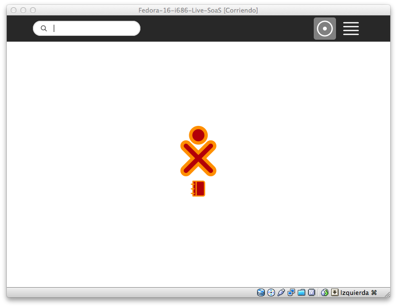
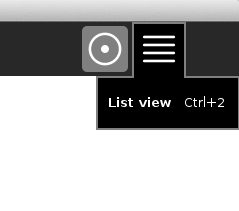
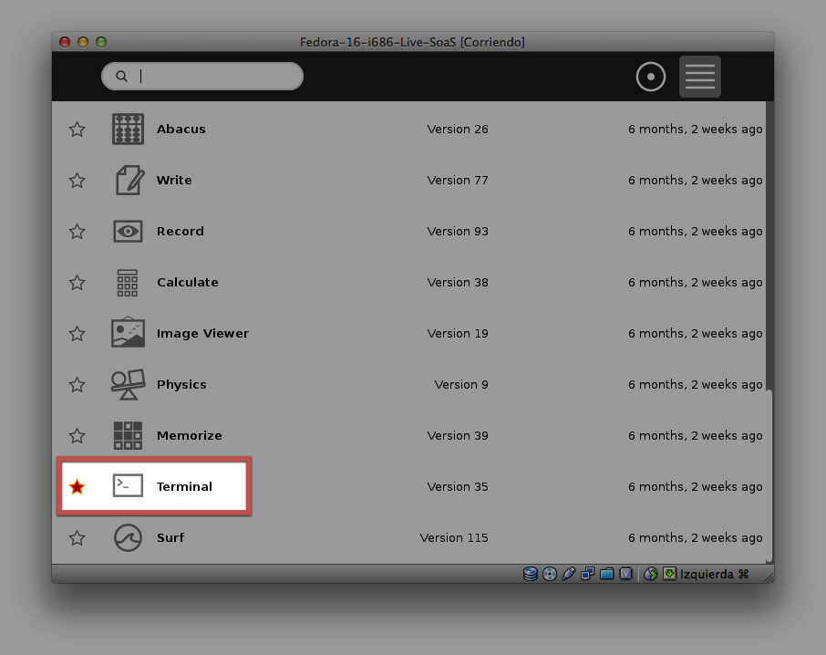
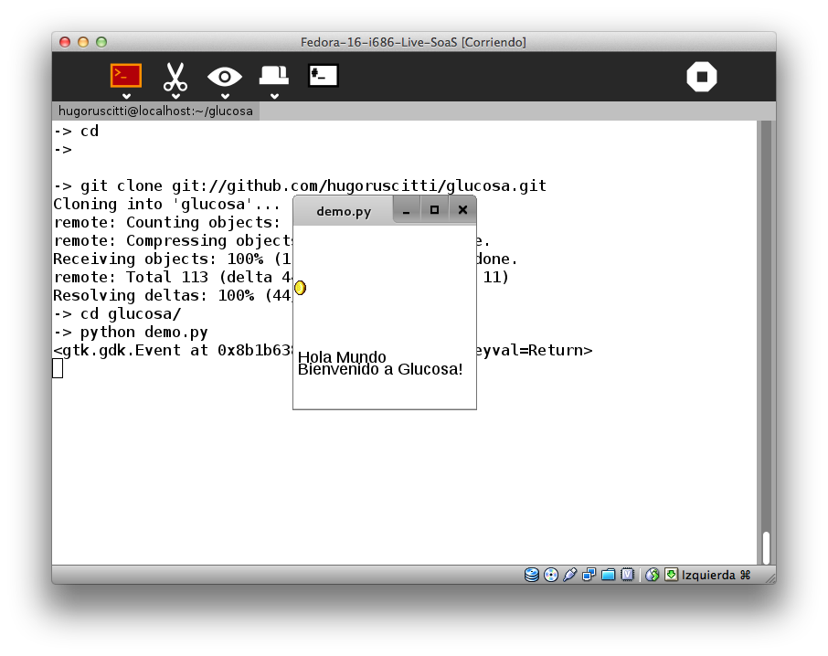

Cómo usar glucosa desde Sugar XO
================================

Para realizar puebas, y conocer la bilioteca, puedes
descargar todo el código del repositorio y ejecutar
nuestros demos.

Abre el entorno Sugar, ya sea desde una máquina XO, un
emulador o máquina virtual. El proceso es el mismo en
cualquier caso:

Una vez iniciado, elige la vista de lista:

y luego abre la consola:

Ahí, tienes que escribir los siguientes
comandos::

    cd
    git clone git://github.com/hugoruscitti/glucosa.git
    cd glucosa
    python demo.py

Y en la pantalla aparecerá un pequeño ejemplo indicado
que todo a funcionado bien:

Fecilitaciones!
